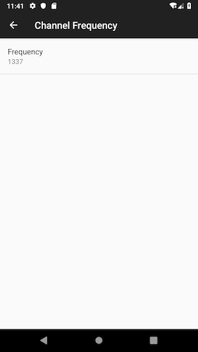

# Group # 06

## Member(s)
### Member 1.

*	__Name:__ Muhammad Awais Aslam
*	__Email Address:__ aaslam.dev@icloud.com
*	__Student Number:__ 2473910
*	__Phone:__ +358 45 7876 9298

## Third Party SDK(s)

* [Firebase Google](https://firebase.google.com)
* [Firebase Crashlytics](https://firebase.google.com/docs/crashlytics/)

## Credits 

*   Icon made by [photo3idea-studio](https://www.flaticon.com/authors/photo3idea-studio) from www.flaticon.com 
*   Icon made by [smashicons](https://www.flaticon.com/authors/smashicons) from www.flaticon.com 
*   Icon made by [Freepik](https://www.freepik.com/) from www.flaticon.com
*   Icon made by [Freepik](https://www.freepik.com/) from www.flaticon.com 

## API Level 

1. Target SDK API Level is 28. (Android 9)
2. Minimum Target SDK API Level is 19. (Kitkat)

__Crashlytics SDK is integrated in the app to investigate weird issues if happen on other API versions. I ran the client on Android 9 and 7.1__

## Build Instructions

1. Clone the repository on your local machine. You can find the Clone link on bitbucket repository __Source__ page. 
2. Launch Android Studio. 
3. Select Open an existing Android Studio Project. 
4. Navigate to the folder where you cloned the repo, and click on open. 
5. Wait for the android studio to setup and sync project. 
6. Build the project. 
7. Once, gradle build has successfully finished, press Play to launch CWP Client. 
8. You can launch on any android virtual available device or physical android phone. 

## Usage Instructions

### Connecting to the CWP Server
1. The app is launched in __Disconnected__ mode for the first time. You can access the control interface by swiping to the right side. Press connect to request connection to CWP Server with default settings. 
2. You can change the CWP server address and port in CWP Server settings using preferences panel. 
2. __Auto-Reconnect__ is enabled by default. The app connects to CWP server automatically on the second app launch and onwards. Client also automatically connect to CWP server after updating the app settings. You can disable Auto-Reconnect in CWP Server settings using preferences panel. 
3. The Lamp is Off in __Disconnected__ state.  

### Sending Messages

1. When the connection is established and channel frequency is set, you can access the tapping interface by swiping to the left side. 
2. Touch the lamp to send Line Up/Line Down message.
3. __Line Up signal__ is transmitted to the server when you touch down on lamp. 
4. __Line Down signal__ is transmitted to the server when you stop touch.
5. Messages are transmitted to the channel frequency set by the user.
6. The Lamp is Dim in __Line Down__ state, full bright in __Line Up__ state.
7. The two indicators on the top of the tapping fragment shows who set the LineUp state. The left indicator is turned on, if the user has set the line up state and the right indicator is turned on when server has set the line up state. 

### Changing Frequency

1. The default frequency is __1__. 
2. You can change the frequency quickly through control interface, enter the new frequency and press change or press done button on keyboard to change the frequency. This action changes the frequency without disconnecting from CWP server.
3. You can also change the frequency in client settings. This action enforces the client to reconnect with the server using new frequency. If auto-reconnect is not enabled, press Connect to initiate connection with the server. 
4. You can select channel frequency between __1-2147483647__
5. You should never use __2147483648__ as a channel frequency.

### Line Up Message Alerts

1. Beep is generated by the client, whenever line Up message is generated by the user or received by the server. Beep is enabled by default. 
2. You can mute beep in client settings. 
3. You can also set the beep volume between 0 and 100. 

## Exercise Work Process 

The app is developed solely by me. When all tasks in the doings were finished and tested, the commit was tagged. In some doings, there were bugs found later so fix is in the later tags. The course work is completed mostly during weekends in 2-3 hours sitting. Some parts of the code were developed while commuting. There were only 2-3 all nighters when things got really interesting in doings 5 & 6. Finally, there were few long hours spent in troubleshooting thread deadlocks. Major development work of the app was finished by the time of mid review deadline. The development was super interesting and it helped me so much in learning Java & Android development.

## Testing Results

### Profiling 

I ran the client on LG6 android phone for profiling the app. Phone was running Android 8.0 (API Level 26). The app was run 3 times for 3 minutes in profiling sessions. Below are the results from profiling. 

1. First item is to measure reception time from socket to play sound. During profiling,LineUp/LineDown messages transmission time were also recorded. 

	* __First Run__

		| Message      |  Minimum  | Maximum | Average | Total |
		| -------------|-----------|---------|---------|-------|
		| Server Event |     3     |   129   |   23    |   78  |
		| Line Up      |     0     |    6    |   2     |   52  |
		| Line Down    |     0     |    4    |   2     |   52  |

	* __Second Run__

		| Message      |  Minimum  | Maximum | Average | Total |
		| -------------|-----------|---------|---------|-------|
		| Server Event |     5     |   135   |   21    |   66  |
		| Line Up      |     1     |    3    |   2     |   57  |
		| Line Down    |     0     |    3    |   2     |   57  |

	* __Third Run__

		| Message      |  Minimum  | Maximum | Average | Total |
		| -------------|-----------|---------|---------|-------|
		| Server Event |     7     |   155   |   21    |   55  |
		| Line Up      |     1     |    7    |   2     |   53  |
		| Line Down    |     0     |    4    |   2     |   53  |

2. Memory comsumption was between 111.5 MB - 112.0 MB during sending and receiving different type of signals. 

### Few Observations
1. I noticed the lagging of toast messages, they seem to take a while to disappear as compared to Huawei Honor 7 running on Android 7.1 (API Level 25)

## Screenshots 

  
  

  
  

Copyright (c) 2019-2020, Awais Aslam.

